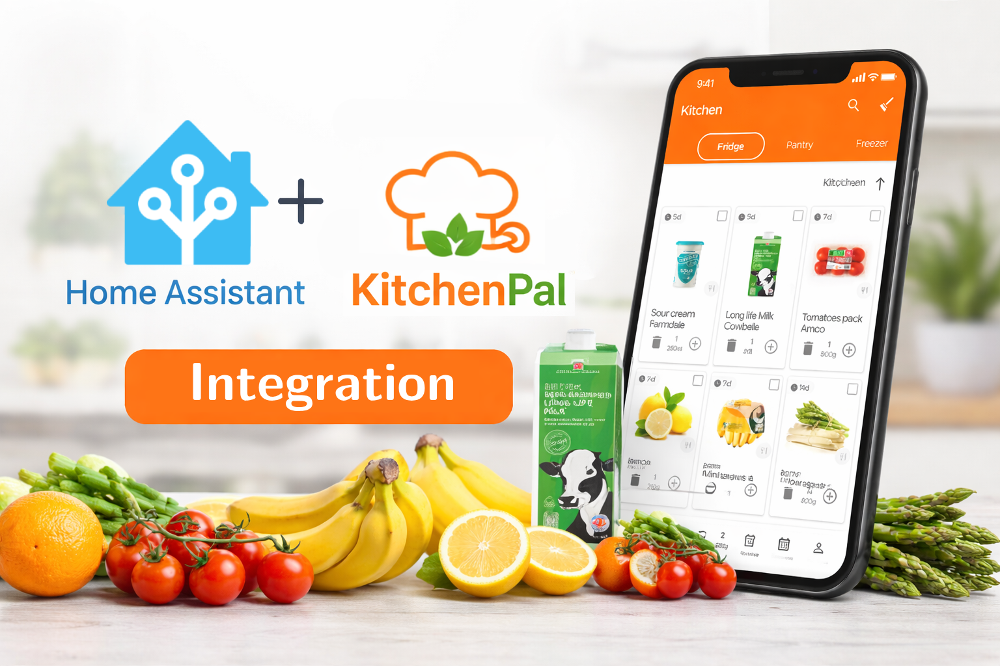

# KitchenPal — Home Assistant Integration

Monitor your fridge and pantry expiry dates directly in Home Assistant.



---

## ⚠️ **Unofficial Integration**

**This project is not affiliated with, endorsed by, or supported by KitchenPal or Home Assistant.**

It is an independent, community-built integration that uses KitchenPal’s private API.  
As a result:

- ⚠️ The API may change or break at any time
- 🔐 You are responsible for keeping your Bearer token secure
- 🚫 Use at your own risk

---

## 📋 Table of Contents
1. [How to get your Bearer Token](#1-how-to-get-your-bearer-token)
2. [Installation](#2-installation)
3. [Adding the Integration](#3-adding-the-integration)
4. [Entities Created](#4-entities-created)
5. [Manual Refresh Action](#5-manual-refresh-action)
6. [Automation Example](#6-automation-example)

---

## 1. How to Get Your Bearer Token

The Bearer token is generated by KitchenPal's servers when you log in. You need to intercept it once — it lasts **1 year**.

---

### Option A — Android / iOS (HTTP Toolkit)

**HTTP Toolkit** is the easiest method on mobile.

1. Install **HTTP Toolkit** on your computer: https://httptoolkit.com
2. On your **Android phone**, install the HTTP Toolkit companion app from the Play Store
3. Open HTTP Toolkit on your computer and click **"Android device via ADB"**
4. Connect your phone via USB and follow the prompts — it will install a certificate automatically
5. Open the **KitchenPal app** on your phone
6. In HTTP Toolkit on your computer, go to the **"HTTP"** tab
7. Filter requests by `kitchenpal` or look for requests to `api-dot-kitchenpal-engine-prod.nw.r.appspot.com`
8. Click any request → look at the **Request Headers**
9. Copy the value after `Authorization: Bearer ` — that long string is your token

> **iOS:** Use HTTP Toolkit with the iOS setup guide at https://httptoolkit.com/docs/guides/ios/

---

### Option B — Android (HttpCanary / PCAPdroid)

1. Install **HttpCanary** (Samsung Galaxy Store / APK) or **PCAPdroid** (Play Store)
2. Start capturing, open KitchenPal, make any action (open the app, scroll)
3. Find a request to `api-dot-kitchenpal-engine-prod.nw.r.appspot.com`
4. Open the request → Headers → copy the `Authorization` header value (without the word `Bearer `)

---

### Option C — Computer (Charles Proxy / mitmproxy)

1. Install **mitmproxy**: https://mitmproxy.org or **Charles**: https://www.charlesproxy.com
2. Configure your phone's WiFi proxy to point to your computer's IP on port `8080`
3. Install the mitmproxy/Charles SSL certificate on your phone (follow their guide)
4. Open KitchenPal on your phone
5. In mitmproxy/Charles, find a request to `api-dot-kitchenpal-engine-prod.nw.r.appspot.com`
6. Copy the `Authorization` header value

---

### What the token looks like

```
eyJ0eXAiOiJKV1QiLCJhbGciOiJSUzI1NiJ9.eyJhdWQiOiIxIiwianRpIj...
```

It is a very long string (500+ characters). Copy the **entire** thing.

> ⚠️ Keep your token private — it gives full access to your KitchenPal account.

---

## 2. Installation

### Manual (recommended)

1. Download the latest release zip from the [Releases page](https://github.com/Suleiman700/KitchenPal-HA-Integration/releases)
2. Extract it
3. Copy the `custom_components/kitchenpal/` folder into your Home Assistant config:
   ```
   /config/custom_components/kitchenpal/
   ```
4. **Restart Home Assistant**: Settings → System → Restart

### Via SSH

```bash
cd /config/custom_components
# Upload the kitchenpal folder here, then restart HA
```

### Via HACS (once published)

1. HACS → Integrations → ⋮ → Custom repositories
2. Add your repo URL, category = Integration
3. Install **KitchenPal** → Restart HA

---

## 3. Adding the Integration

1. Go to **Settings → Devices & Services**
2. Click **"+ Add Integration"** (bottom right)
3. Search for **KitchenPal**
4. Paste your Bearer token into the field
5. Click **Submit**

Home Assistant will validate the token by making a test API call. If it succeeds, all your items will appear as entities immediately.

---

## 4. Entities Created

For each item in your kitchen, **two entities** are created:

| Entity | Type | State | Icon |
|--------|------|-------|------|
| `sensor.kitchenpal_integration_<name>` | Sensor | Expiry date (`2026-04-07`) or `Expired` | Food category icon |
| `binary_sensor.kitchenpal_integration_<name>_expired` | Binary Sensor | `on` = expired / `off` = fresh | Clock icon (changes with urgency) |
| `button.kitchenpal_integration_refresh` | Button | — | Refresh icon |

### Binary sensor icons

| State | Icon | Meaning |
|-------|------|---------|
| `mdi:clock-check` | ✅ Green clock | Fresh, plenty of time |
| `mdi:clock-outline` | 🕐 Clock | Expires within 7 days |
| `mdi:clock-end` | ⏰ Clock end | Expires within 3 days |
| `mdi:clock-alert` | 🚨 Alert clock | **Already expired** |

### Sensor attributes

Each sensor exposes these attributes:

```yaml
kitchen_record_id: 11704867
barcode: "7290004131074"
storage: "Fridge"          # or "Pantry"
quantity: 1
unit: "l"
pieces: 1
filling: 1.0
expiry_date: "2026-04-06T00:00:00+00:00"
days_until_expiry: 13      # negative = already expired
category: "Dairy"
image_url: "https://storage.googleapis.com/..."
updated_at: "2026-03-18T..."
created_at: "2026-03-18T..."
```

---

## 5. Manual Refresh Action

The integration polls automatically every **15 minutes**. To force an immediate refresh:

### Option A — Press the button entity

In **Settings → Devices & Services → KitchenPal**, find the **"kitchenpal_integration_refresh"** button and press it.

Or add it to your dashboard as a button card.

### Option B — Call the action from Developer Tools

1. Go to **Developer Tools → Actions**
2. Select action: `button.press`
3. Target entity: `button.kitchenpal_integration_refresh`
4. Click **"Perform Action"**

### Option C — Trigger from an automation

```yaml
action:
  - action: button.press
    target:
      entity_id: button.kitchenpal_integration_refresh
```

---

## 6. Automation Example

### Notify when any item expires today

```yaml
automation:
  - alias: "KitchenPal — Daily expiry check"
    trigger:
      - platform: time
        at: "08:00:00"
    action:
      - variables:
          expired_items: >
            {{ states.binary_sensor
               | selectattr('entity_id', 'search', 'kitchenpal_integration')
               | selectattr('state', 'eq', 'on')
               | map(attribute='attributes.item_name')
               | list }}
      - condition: template
        value_template: "{{ expired_items | length > 0 }}"
      - action: notify.mobile_app_your_phone
        data:
          title: "🗑️ KitchenPal — Expired Items"
          message: "These items have expired: {{ expired_items | join(', ') }}"
```

### Notify 2 days before expiry

```yaml
automation:
  - alias: "KitchenPal — Expiring soon warning"
    trigger:
      - platform: time
        at: "09:00:00"
    action:
      - variables:
          expiring: >
            {{ states.sensor
               | selectattr('entity_id', 'search', 'kitchenpal_integration')
               | selectattr('attributes.days_until_expiry', 'defined')
               | selectattr('attributes.days_until_expiry', 'le', 2)
               | selectattr('attributes.days_until_expiry', 'ge', 0)
               | map(attribute='name') | list }}
      - condition: template
        value_template: "{{ expiring | length > 0 }}"
      - action: notify.mobile_app_your_phone
        data:
          title: "⚠️ Expiring Soon"
          message: "Use these soon: {{ expiring | join(', ') }}"
```

---

## 7. Node-RED Integration

### Prerequisites

Make sure you have the **node-red-contrib-home-assistant-websocket** palette installed in Node-RED:
1. Node-RED → ☰ Menu → **Manage palette**
2. Search `node-red-contrib-home-assistant-websocket` → Install

---

### Importing a Flow

1. Download the JSON file from the `node-red/` folder in this repo
2. In Node-RED → ☰ Menu → **Import**
3. Paste the JSON or upload the file → Click **Import**
4. Click the **ha-get-entities** node → select your Home Assistant server from the dropdown
5. Click **Deploy**

> ⚠️ The JSON files use `"YOUR_HA_SERVER_ID"` as a placeholder. After importing, you **must** open the `ha-get-entities` node and select your HA server from the dropdown — otherwise the flow won't work.

---

### Available Flows

#### `kitchenpal-expired-items.json`
Gets all items that are **already expired**.

**Nodes:**
```
[Inject] → [Get Entities: binary_sensor.kitchenpal_integration_*] → [Function: filter state=on] → [Debug]
```

**Output example:**
```json
[
  { "name": "Yotvata Choco", "days_expired": 2, "storage": "Pantry", "barcode": "7290003029181" },
  { "name": "Trio Chocolate", "days_expired": 1, "storage": "Pantry", "barcode": "290414557423" }
]
```

---

#### `kitchenpal-expiring-soon.json`
Gets all items expiring **within the next 3 days** (not yet expired).

**Nodes:**
```
[Inject] → [Get Entities: binary_sensor.kitchenpal_integration_*] → [Function: filter days 0-3] → [Debug]
```

**Output example:**
```json
[
  { "name": "Mehadrin Milk", "days_left": 1, "storage": "Fridge", "barcode": "7290004131074" }
]
```

---

#### `kitchenpal-combined.json`
Runs **both** checks from a single trigger — one output for expired, one for expiring soon.

**Nodes:**
```
[Inject] → [Get Entities] → [Function: Expired]      → [Debug: Expired]
                          → [Function: Expiring Soon] → [Debug: Expiring Soon]
```

---

### Customizing the Expiry Warning Window

In the function node, change `<= 3` to any number of days you want:

```javascript
// Example: warn 7 days before expiry
return days !== null && days >= 0 && days <= 7;
```

---

### Daily Scheduled Alert Example

To run automatically every morning at 8am, configure the **Inject** node:

- Repeat: `at a specific time`
- Time: `08:00`
- On: `Mon Tue Wed Thu Fri Sat Sun`

Then wire the output to a **notify** node or **call service** node to send a push notification.

---

## Author

**Suleiman**
- Email: soleman630@gmail.com
- GitHub: [@Suleiman700](https://github.com/Suleiman700)
- Repository: [KitchenPal-HA-Integration](https://github.com/Suleiman700/KitchenPal-HA-Integration)

---